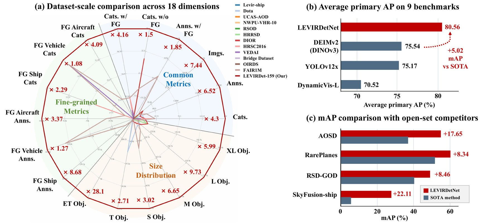
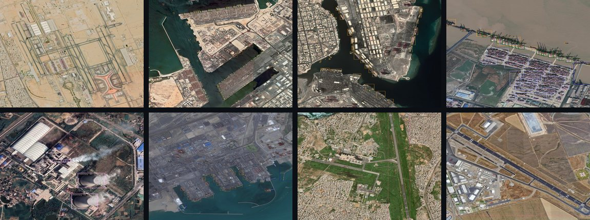
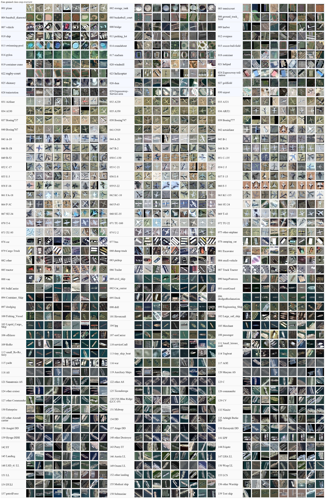
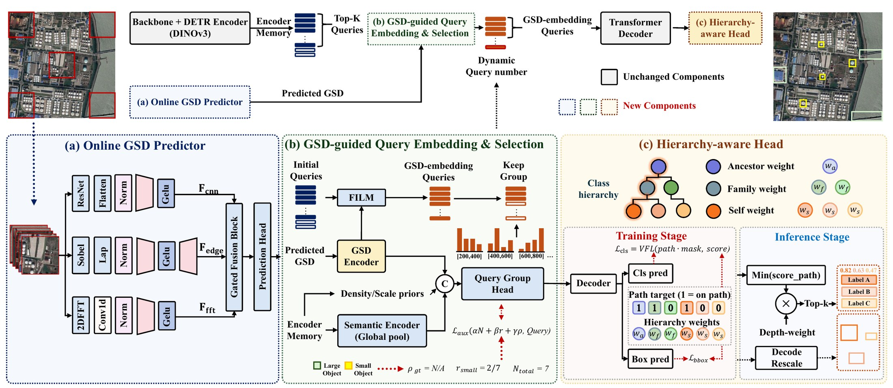

# LEVIRDet

**A Million-Scale 159-Category Dataset and Foundation Model for Universal Remote Sensing Object Detection**

[](https://qinzheyang.github.io/LEVIRDet/)
[](https://qinzheyang.github.io/LEVIRDet/levir-demo/)
[](https://arxiv.org/pdf/2606.25312)
[](#release-status)

> **Release notice.** The full image tiles, annotations, source-license
> manifest, code, and trained models will be released in a versioned project
> repository at <https://qinzheyang.github.io/LEVIRDet/> and <https://github.com/QinzheYang/LEVIRDet-release>, accompanying
> the final paper.


## Overview and Performance



LEVIRDet-159 reaches the largest scale across 18 dataset dimensions, while
LEVIRDetNet achieves the best average primary AP on 9 external benchmarks
without target-domain training or fine-tuning.

Under stringent evaluation settings, LEVIRDetNet demonstrates strong
cross-domain generalization. Even without target-domain training or fine-tuning,
it achieves state-of-the-art detection performance on 9 external benchmarks,
improving the strongest fully supervised competing methods by **5.02 mAP** on
average under each benchmark's primary metric. It also remains strongest in
score-threshold comparisons with open-set and grounding models, maintaining
stable precision and recall at practical confidence thresholds.

## Demo

Try the interactive web demo:

- [Object Detection](https://qinzheyang.github.io/LEVIRDet/levir-demo/)
- [Fine-grained Object Detection](https://qinzheyang.github.io/LEVIRDet/levir-demo/)
- [Ultra-Wide Area Object Detection](https://qinzheyang.github.io/LEVIRDet/levir-demo/)



## Overview

Remote sensing object detection has advanced rapidly with the development of
large-scale benchmarks and modern detection architectures. However, existing
datasets and detectors remain fragmented: most benchmarks focus on limited
categories, fixed spatial resolutions, or a single sensor, while detectors still
struggle to work across different sensors and categorical systems.

We introduce **LEVIRDet-159**, the largest and most comprehensive remote sensing
object detection dataset to date, with **159 categories**, **~2.56 million
bounding boxes**, and **~700k fine-grained annotations** under a multi-level
taxonomy. In each key scale dimension, LEVIRDet-159 exceeds the corresponding
largest existing remote sensing object detection dataset, containing
approximately **7x more images**, **6x more object instances**, and **4x more
categories**.

Based on this dataset, we design **LEVIRDetNet**, a
scale-hierarchy-aware detection foundation model for universal remote sensing
object detection. LEVIRDetNet couples online visual Ground Sampling Distance
(GSD) prediction, GSD-conditioned query modulation and allocation, and a
hierarchy-aware detection head for mixed-granularity remote sensing supervision.

## Highlights

- **Million-scale remote sensing detection dataset.** LEVIRDet-159 contains
  ~2.56M bounding boxes across 159 categories.
- **Fine-grained multi-level taxonomy.** The dataset includes ~700k
  fine-grained annotations, especially expanding aircraft, vehicle, and ship
  categories.
- **Universal detector.** LEVIRDetNet is designed to operate across sensors,
  spatial resolutions, and category systems.
- **Strong cross-domain generalization.** Without target-domain training or
  fine-tuning, LEVIRDetNet achieves state-of-the-art performance on 9 external
  benchmarks.
- **Interactive demonstrations.** The project page includes object detection,
  fine-grained detection, and ultra-wide-area detection demos.


## Dataset Scale




LEVIRDet-159 covers 30 common parent categories and 159 category types across
global regions, diverse imaging conditions, multiple sensors, and a broad range
of object sizes.

## LEVIRDetNet



LEVIRDetNet is a scale-hierarchy-aware detection foundation model for universal
remote sensing object detection. It combines three key components:

1. **Online GSD predictor** for estimating visual ground sampling distance from
   input imagery.
2. **GSD-guided query embedding and selection** for dynamic query modulation and
   allocation under varying spatial resolutions.
3. **Hierarchy-aware detection head** for mixed-granularity supervision and
   category-system transfer.


## Target-Training-Free Benchmark Results

<div align="center">
<table style="min-width: 80%; border: 2px solid #ddd; border-collapse: collapse">
  <thead>
    <tr>
      <th style="border-right: 2px solid #ddd; padding: 12px 20px">Model</th>
      <th style="text-align: center; padding: 12px 20px">ADCOS</th>
      <th style="text-align: center; padding: 12px 20px">UCAS-AOD</th>
      <th style="text-align: center; padding: 12px 20px">HRPlane-v2</th>
      <th style="text-align: center; padding: 12px 20px">CORS-ADD</th>
      <th style="text-align: center; padding: 12px 20px">SkyFusion-plane</th>
      <th style="text-align: center; padding: 12px 20px">VHRV</th>
      <th style="text-align: center; padding: 12px 20px">SkyFusion-ship</th>
      <th style="text-align: center; padding: 12px 20px">NWPU</th>
      <th style="text-align: center; padding: 12px 20px">CarPK</th>
      <th style="text-align: center; padding: 12px 20px">Avg.</th>
    </tr>
  </thead>
  <tbody>
    <tr>
      <td style="border-right: 2px solid #ddd; padding: 10px 20px">DynamicVis-L</td>
      <td style="text-align: center; padding: 10px 20px">77.10</td>
      <td style="text-align: center; padding: 10px 20px">69.90</td>
      <td style="text-align: center; padding: 10px 20px">75.00</td>
      <td style="text-align: center; padding: 10px 20px">64.60</td>
      <td style="text-align: center; padding: 10px 20px">92.70</td>
      <td style="text-align: center; padding: 10px 20px">62.10</td>
      <td style="text-align: center; padding: 10px 20px">45.50</td>
      <td style="text-align: center; padding: 10px 20px">69.10</td>
      <td style="text-align: center; padding: 10px 20px">78.70</td>
      <td style="text-align: center; padding: 10px 20px">70.52</td>
    </tr>
    <tr>
      <td style="border-right: 2px solid #ddd; padding: 10px 20px">YOLOv12x</td>
      <td style="text-align: center; padding: 10px 20px">78.72</td>
      <td style="text-align: center; padding: 10px 20px">74.67</td>
      <td style="text-align: center; padding: 10px 20px">78.51</td>
      <td style="text-align: center; padding: 10px 20px">71.70</td>
      <td style="text-align: center; padding: 10px 20px">94.52</td>
      <td style="text-align: center; padding: 10px 20px">72.58</td>
      <td style="text-align: center; padding: 10px 20px">43.56</td>
      <td style="text-align: center; padding: 10px 20px">65.01</td>
      <td style="text-align: center; padding: 10px 20px">97.29</td>
      <td style="text-align: center; padding: 10px 20px">75.17</td>
    </tr>
    <tr>
      <td style="border-right: 2px solid #ddd; padding: 10px 20px">DEIMv2 (DINOv3)</td>
      <td style="text-align: center; padding: 10px 20px">77.79</td>
      <td style="text-align: center; padding: 10px 20px">75.38</td>
      <td style="text-align: center; padding: 10px 20px">78.87</td>
      <td style="text-align: center; padding: 10px 20px">68.26</td>
      <td style="text-align: center; padding: 10px 20px">97.58</td>
      <td style="text-align: center; padding: 10px 20px">67.58</td>
      <td style="text-align: center; padding: 10px 20px">44.10</td>
      <td style="text-align: center; padding: 10px 20px">73.60</td>
      <td style="text-align: center; padding: 10px 20px">96.74</td>
      <td style="text-align: center; padding: 10px 20px">75.54</td>
    </tr>
    <tr style="border-top: 2px solid #b19c9cff">
      <td style="border-right: 2px solid #ddd; padding: 10px 20px"><strong>LEVIRDetNet</strong></td>
      <td style="text-align: center; padding: 10px 20px"><strong>83.60</strong></td>
      <td style="text-align: center; padding: 10px 20px"><strong>80.40</strong></td>
      <td style="text-align: center; padding: 10px 20px"><strong>81.92</strong></td>
      <td style="text-align: center; padding: 10px 20px"><strong>72.06</strong></td>
      <td style="text-align: center; padding: 10px 20px"><strong>98.27</strong></td>
      <td style="text-align: center; padding: 10px 20px"><strong>73.55</strong></td>
      <td style="text-align: center; padding: 10px 20px"><strong>60.39</strong></td>
      <td style="text-align: center; padding: 10px 20px"><strong>76.04</strong></td>
      <td style="text-align: center; padding: 10px 20px"><strong>98.79</strong></td>
      <td style="text-align: center; padding: 10px 20px"><strong>80.56</strong></td>
    </tr>
  </tbody>
</table>

<p style="text-align: center; margin-top: 10px; font-size: 0.9em; color: #777;">
Values are primary AP metrics from the paper. SkyFusion-plane, SkyFusion-ship,
and CarPK use AP<sub>50</sub>; NWPU uses mAP; the remaining datasets use
AP<sub>bbox</sub>.
</p>
</div>

Additional tables are available in [docs/results.md](docs/results.md).


## Repository Layout

```text
LEVIRDet-release/
|-- README.md
|-- assets/
|   |-- demo_samples/
|   `-- figures/
|-- docs/
|   |-- dataset.md
|   |-- model.md
|   |-- release_plan.md
|   `-- results.md
|-- examples/
|   `-- README.md
|-- CITATION.cff
|-- CONTRIBUTING.md
|-- LICENSE.md
`-- NOTICE.md
```

## Release Status

This repository is currently a project landing repository. The following
artifacts are planned for release with the final paper:

- Full image tiles.
- Tight horizontal bounding-box annotations.
- Fine-grained multi-level taxonomy annotations.
- Source-license manifest.
- Training and evaluation code.
- Trained LEVIRDetNet checkpoints.
- Inference and demo scripts.

The full image tiles, annotations, source-license manifest, code, and trained
models will be released in a versioned project repository at
<https://qinzheyang.github.io/LEVIRDet/>, accompanying the final paper.

## Getting Started

The installation and inference instructions will be added when the code release
is ready. The planned workflow is:

```bash
git clone https://github.com/QinzheYang/LEVIRDet.git
cd LEVIRDet

# Installation instructions will be added with the code release.
# Dataset download and checkpoint download commands will be versioned.
```

## Citation

If you find this project useful, please cite the final paper once it is
available. A provisional citation file is provided in [CITATION.cff](CITATION.cff)
and will be updated with the camera-ready metadata.

```bash
@misc{yang2026levirdetmillionscale159categorydataset,
      title={LEVIRDet: A Million-Scale 159-Category Dataset and Foundation Model for Universal Remote Sensing Object Detection}, 
      author={Qinzhe Yang and Dongyu Wang and Haohan Niu and Jia Xu and Zhenwei Shi and Zhengxia Zou},
      year={2026},
      eprint={2606.25312},
      archivePrefix={arXiv},
      primaryClass={cs.CV},
      url={https://arxiv.org/abs/2606.25312}, 
}
```

## License

The code, dataset, annotations, and trained models are not yet released. Their
licenses will be specified with the versioned release. See [LICENSE.md](LICENSE.md)
and [NOTICE.md](NOTICE.md) for the current pre-release notice.
