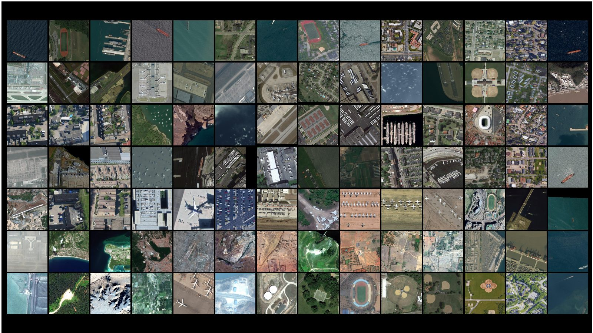
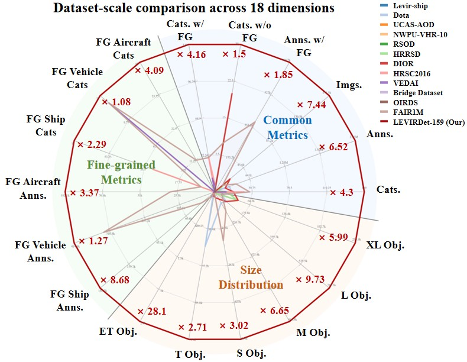
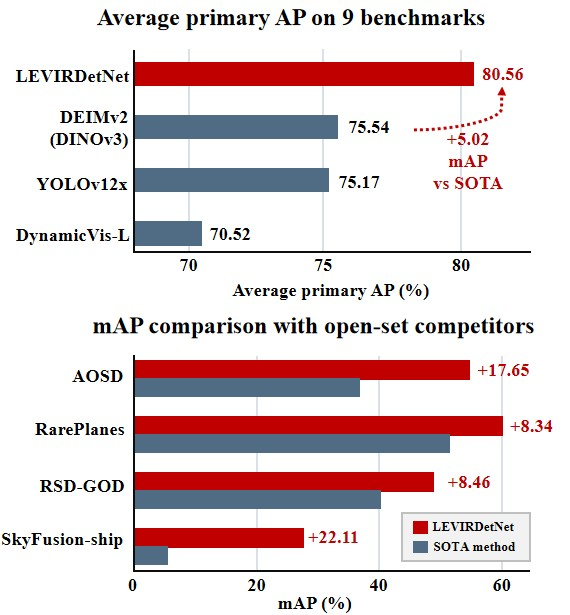

# LEVIRDet

**A Million-Scale 159-Category Dataset and Foundation Model for Universal Remote Sensing Object Detection**

[](https://qinzheyang.github.io/LEVIRDet/)
[](https://qinzheyang.github.io/LEVIRDet/levir-demo/)
[](https://www.sciengine.com/cfs/files/pdfs/view/1674-733X/6E3CAFCF2A464C9BBC0BE785B15D8300-mark.pdf)
[](#release-status)

> **Release notice.** The full image tiles, annotations, source-license
> manifest, code, and trained models will be released in a versioned project
> repository at <https://qinzheyang.github.io/LEVIRDet-Website/>, accompanying
> the final paper.



## Overview

Remote sensing object detection has advanced rapidly with the development of
large-scale benchmarks and modern detection architectures. However, existing
datasets and detectors remain fragmented: most benchmarks focus on limited
categories, fixed spatial resolutions, or a single sensor, while detectors still
struggle to work across different sensors and categorical systems.

We introduce **LEVIRDet-159**, the largest and most comprehensive remote sensing
object detection dataset to date, with **159 categories**, **~2.56 million
bounding boxes**, and **~700k fine-grained annotations** under a multi-level
taxonomy. In each key scale dimension, LEVIRDet-159 exceeds the corresponding
largest existing remote sensing object detection dataset, containing
approximately **7x more images**, **6x more object instances**, and **4x more
categories**.

Based on this dataset, we design **LEVIRDetNet**, a
scale-hierarchy-aware detection foundation model for universal remote sensing
object detection. LEVIRDetNet couples online visual Ground Sampling Distance
(GSD) prediction, GSD-conditioned query modulation and allocation, and a
hierarchy-aware detection head for mixed-granularity remote sensing supervision.

## Highlights

- **Million-scale remote sensing detection dataset.** LEVIRDet-159 contains
  ~2.56M bounding boxes across 159 categories.
- **Fine-grained multi-level taxonomy.** The dataset includes ~700k
  fine-grained annotations, especially expanding aircraft, vehicle, and ship
  categories.
- **Universal detector.** LEVIRDetNet is designed to operate across sensors,
  spatial resolutions, and category systems.
- **Strong cross-domain generalization.** Without target-domain training or
  fine-tuning, LEVIRDetNet achieves state-of-the-art performance on 9 external
  benchmarks.
- **Interactive demonstrations.** The project page includes object detection,
  fine-grained detection, and ultra-wide-area detection demos.

## Dataset Scale



LEVIRDet-159 covers 30 common parent categories and 159 category types across
global regions, diverse imaging conditions, multiple sensors, and a broad range
of object sizes.

## LEVIRDetNet


LEVIRDetNet is a scale-hierarchy-aware detection foundation model for universal
remote sensing object detection. It combines three key components:

1. **Online GSD predictor** for estimating visual ground sampling distance from
   input imagery.
2. **GSD-guided query embedding and selection** for dynamic query modulation and
   allocation under varying spatial resolutions.
3. **Hierarchy-aware detection head** for mixed-granularity supervision and
   category-system transfer.

## Results



Under stringent evaluation settings, LEVIRDetNet demonstrates strong
cross-domain generalization. Even without target-domain training or fine-tuning,
it achieves state-of-the-art detection performance on 9 external benchmarks,
improving the strongest fully supervised competing methods by **5.02 mAP** on
average under each benchmark's primary metric. It also remains strongest in
score-threshold comparisons with open-set and grounding models, maintaining
stable precision and recall at practical confidence thresholds.

## Demo

Try the interactive web demo:

- [Object Detection](https://qinzheyang.github.io/LEVIRDet/levir-demo/)
- [Fine-grained Object Detection](https://qinzheyang.github.io/LEVIRDet/levir-demo/)
- [Ultra-Wide Area Object Detection](https://qinzheyang.github.io/LEVIRDet/levir-demo/)


## Repository Layout

```text
LEVIRDet-release/
├── README.md
├── assets/
│   ├── demo_samples/
│   └── figures/
├── docs/
│   ├── dataset.md
│   ├── model.md
│   └── release_plan.md
├── examples/
│   └── README.md
├── CITATION.cff
├── CONTRIBUTING.md
├── LICENSE.md
└── NOTICE.md
```

## Release Status

This repository is currently a project landing repository. The following
artifacts are planned for release with the final paper:

- Full image tiles.
- Tight horizontal bounding-box annotations.
- Fine-grained multi-level taxonomy annotations.
- Source-license manifest.
- Training and evaluation code.
- Trained LEVIRDetNet checkpoints.
- Inference and demo scripts.

The full image tiles, annotations, source-license manifest, code, and trained
models will be released in a versioned project repository at
<https://qinzheyang.github.io/LEVIRDet-Website/>, accompanying the final paper.

## Getting Started

The installation and inference instructions will be added when the code release
is ready. The planned workflow is:

```bash
git clone https://github.com/QinzheYang/LEVIRDet.git
cd LEVIRDet

# Installation instructions will be added with the code release.
# Dataset download and checkpoint download commands will be versioned.
```

## Citation

If you find this project useful, please cite the final paper once it is
available. A provisional citation file is provided in [CITATION.cff](CITATION.cff)
and will be updated with the camera-ready metadata.

## License

The code, dataset, annotations, and trained models are not yet released. Their
licenses will be specified with the versioned release. See [LICENSE.md](LICENSE.md)
and [NOTICE.md](NOTICE.md) for the current pre-release notice.

