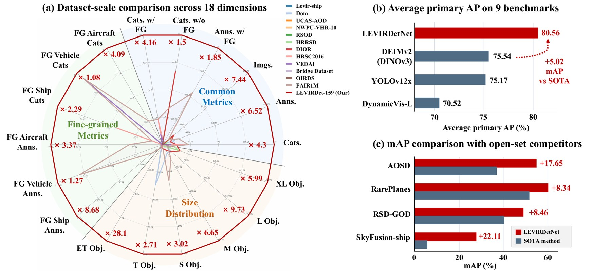
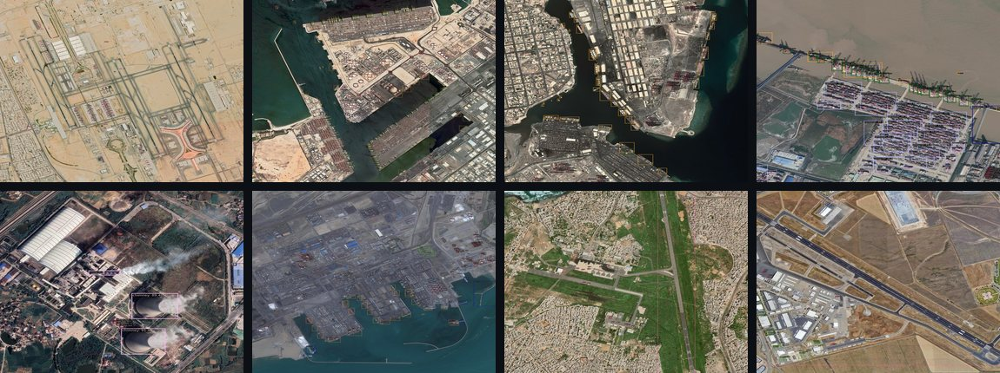
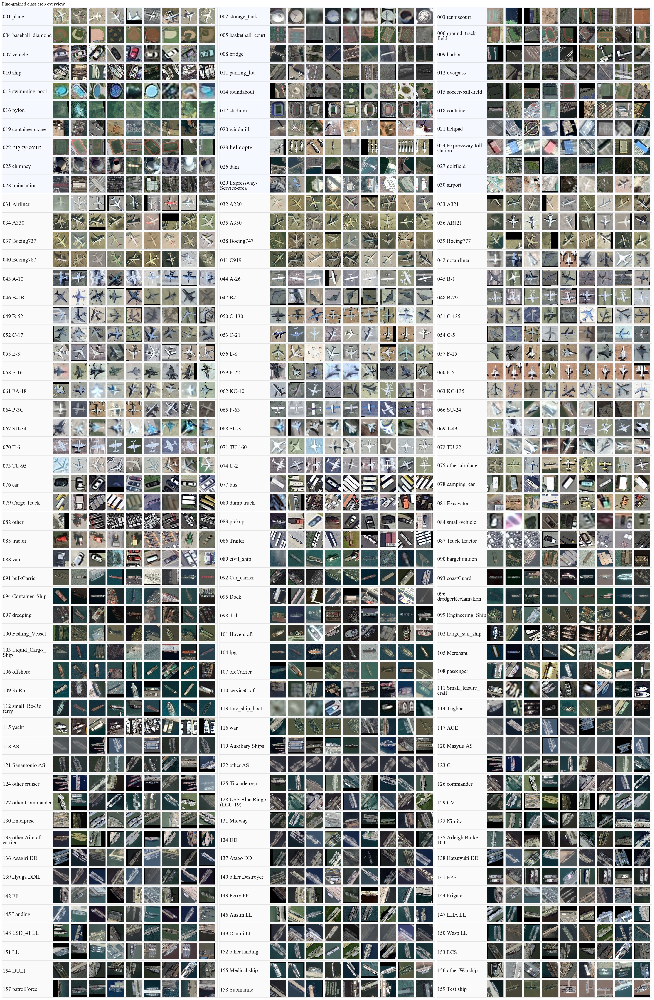
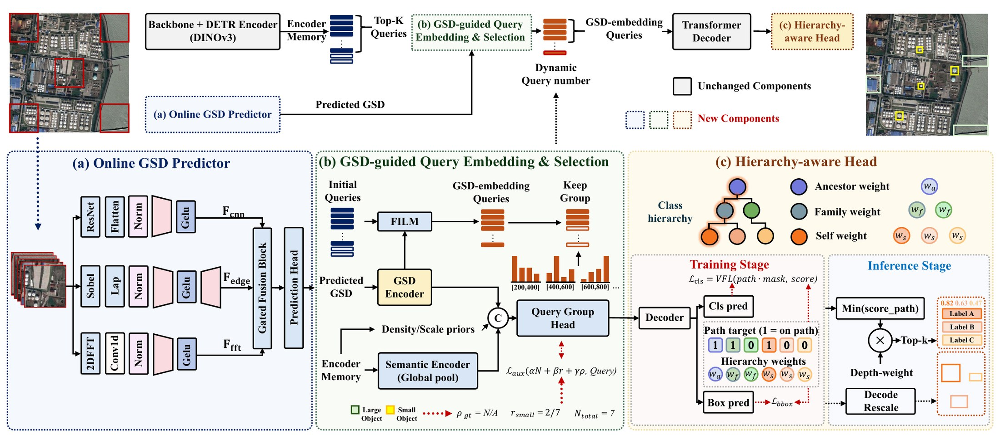

# LEVIRDet

**A Million-Scale 159-Category Dataset and Foundation Model for Universal Remote Sensing Object Detection**

[](https://qinzheyang.github.io/LEVIRDet/)
[](https://qinzheyang.github.io/LEVIRDet/levir-demo/)
[](https://arxiv.org/abs/2606.25312)
[](#release-status)

> **Release notice.** The full image tiles, annotations, source-license
> manifest, code, and trained models will be released in a versioned project
> repository at <https://qinzheyang.github.io/LEVIRDet/> and <https://github.com/QinzheYang/LEVIRDet-release>, accompanying
> the final paper.


## Overview and Performance



LEVIRDet-159 reaches the largest scale across 18 dataset dimensions, while
LEVIRDetNet achieves the best average primary AP on 9 external benchmarks
without target-domain training or fine-tuning.

Under stringent evaluation settings, LEVIRDetNet demonstrates strong
cross-domain generalization. Even without target-domain training or fine-tuning,
it achieves state-of-the-art detection performance on 9 external benchmarks,
improving the strongest fully supervised competing methods by **5.02 mAP** on
average under each benchmark's primary metric. It also remains strongest in
score-threshold comparisons with open-set and grounding models, maintaining
stable precision and recall at practical confidence thresholds.

## Demo

Try the interactive web demo:

- [Object Detection](https://qinzheyang.github.io/LEVIRDet/levir-demo/)
- [Fine-grained Object Detection](https://qinzheyang.github.io/LEVIRDet/levir-demo/)
- [Ultra-Wide Area Object Detection](https://qinzheyang.github.io/LEVIRDet/levir-demo/)



## Overview

Remote sensing object detection has advanced rapidly with the development of
large-scale benchmarks and modern detection architectures. However, existing
datasets and detectors remain fragmented: most benchmarks focus on limited
categories, fixed spatial resolutions, or a single sensor, while detectors still
struggle to work across different sensors and categorical systems.

We introduce **LEVIRDet-159**, the largest and most comprehensive remote sensing
object detection dataset to date, with **159 categories**, **~2.56 million
bounding boxes**, and **~700k fine-grained annotations** under a multi-level
taxonomy. In each key scale dimension, LEVIRDet-159 exceeds the corresponding
largest existing remote sensing object detection dataset, containing
approximately **7x more images**, **6x more object instances**, and **4x more
categories**.

Based on this dataset, we design **LEVIRDetNet**, a
scale-hierarchy-aware detection foundation model for universal remote sensing
object detection. LEVIRDetNet couples online visual Ground Sampling Distance
(GSD) prediction, GSD-conditioned query modulation and allocation, and a
hierarchy-aware detection head for mixed-granularity remote sensing supervision.

## Highlights

- **Million-scale remote sensing detection dataset.** LEVIRDet-159 contains
  ~2.56M bounding boxes across 159 categories.
- **Fine-grained multi-level taxonomy.** The dataset includes ~700k
  fine-grained annotations, especially expanding aircraft, vehicle, and ship
  categories.
- **Universal detector.** LEVIRDetNet is designed to operate across sensors,
  spatial resolutions, and category systems.
- **Strong cross-domain generalization.** Without target-domain training or
  fine-tuning, LEVIRDetNet achieves state-of-the-art performance on 9 external
  benchmarks.
- **Interactive demonstrations.** The project page includes object detection,
  fine-grained detection, and ultra-wide-area detection demos.


## Update Log

🌟 **2026.10.02** 

We received reviewers' comments two days ago and are now actively preparing the release.

These preparations include converting the dataset into a more storage-efficient format to reduce download size, creating a Docker image to make it easier to run the model, and organizing the pre-trained weights, usage instructions, and training logs. We are also preparing the baseline models and corresponding weights used in our paper, updating the project homepage, and adding more convenient download options.

While completing all of these preparations will take some time, we can confirm that the dataset will be released within the next week. The pre-trained LEVIRDetNet weights and associated model resources may take slightly longer to finalize. We will share release updates and access instructions on our GitHub page as they become available.


## Dataset Scale




LEVIRDet-159 covers 30 common parent categories and 159 category types across
global regions, diverse imaging conditions, multiple sensors, and a broad range
of object sizes.

## LEVIRDetNet



LEVIRDetNet is a scale-hierarchy-aware detection foundation model for universal
remote sensing object detection. It combines three key components:

1. **Online GSD predictor** for estimating visual ground sampling distance from
   input imagery.
2. **GSD-guided query embedding and selection** for dynamic query modulation and
   allocation under varying spatial resolutions.
3. **Hierarchy-aware detection head** for mixed-granularity supervision and
   category-system transfer.


## Target-Training-Free Benchmark Results

<div align="center">
<table style="min-width: 80%; border: 2px solid #ddd; border-collapse: collapse">
  <thead>
    <tr>
      <th style="border-right: 2px solid #ddd; padding: 12px 20px">Model</th>
      <th style="text-align: center; padding: 12px 20px">ADCOS</th>
      <th style="text-align: center; padding: 12px 20px">UCAS-AOD</th>
      <th style="text-align: center; padding: 12px 20px">HRPlane-v2</th>
      <th style="text-align: center; padding: 12px 20px">CORS-ADD</th>
      <th style="text-align: center; padding: 12px 20px">SkyFusion-plane</th>
      <th style="text-align: center; padding: 12px 20px">VHRV</th>
      <th style="text-align: center; padding: 12px 20px">SkyFusion-ship</th>
      <th style="text-align: center; padding: 12px 20px">NWPU</th>
      <th style="text-align: center; padding: 12px 20px">CarPK</th>
      <th style="text-align: center; padding: 12px 20px">Avg.</th>
    </tr>
  </thead>
  <tbody>
    <tr>
      <td style="border-right: 2px solid #ddd; padding: 10px 20px">DynamicVis-L</td>
      <td style="text-align: center; padding: 10px 20px">77.10</td>
      <td style="text-align: center; padding: 10px 20px">69.90</td>
      <td style="text-align: center; padding: 10px 20px">75.00</td>
      <td style="text-align: center; padding: 10px 20px">64.60</td>
      <td style="text-align: center; padding: 10px 20px">92.70</td>
      <td style="text-align: center; padding: 10px 20px">62.10</td>
      <td style="text-align: center; padding: 10px 20px">45.50</td>
      <td style="text-align: center; padding: 10px 20px">69.10</td>
      <td style="text-align: center; padding: 10px 20px">78.70</td>
      <td style="text-align: center; padding: 10px 20px">70.52</td>
    </tr>
    <tr>
      <td style="border-right: 2px solid #ddd; padding: 10px 20px">YOLOv12x</td>
      <td style="text-align: center; padding: 10px 20px">78.72</td>
      <td style="text-align: center; padding: 10px 20px">74.67</td>
      <td style="text-align: center; padding: 10px 20px">78.51</td>
      <td style="text-align: center; padding: 10px 20px">71.70</td>
      <td style="text-align: center; padding: 10px 20px">94.52</td>
      <td style="text-align: center; padding: 10px 20px">72.58</td>
      <td style="text-align: center; padding: 10px 20px">43.56</td>
      <td style="text-align: center; padding: 10px 20px">65.01</td>
      <td style="text-align: center; padding: 10px 20px">97.29</td>
      <td style="text-align: center; padding: 10px 20px">75.17</td>
    </tr>
    <tr>
      <td style="border-right: 2px solid #ddd; padding: 10px 20px">DEIMv2 (DINOv3)</td>
      <td style="text-align: center; padding: 10px 20px">77.79</td>
      <td style="text-align: center; padding: 10px 20px">75.38</td>
      <td style="text-align: center; padding: 10px 20px">78.87</td>
      <td style="text-align: center; padding: 10px 20px">68.26</td>
      <td style="text-align: center; padding: 10px 20px">97.58</td>
      <td style="text-align: center; padding: 10px 20px">67.58</td>
      <td style="text-align: center; padding: 10px 20px">44.10</td>
      <td style="text-align: center; padding: 10px 20px">73.60</td>
      <td style="text-align: center; padding: 10px 20px">96.74</td>
      <td style="text-align: center; padding: 10px 20px">75.54</td>
    </tr>
    <tr style="border-top: 2px solid #b19c9cff">
      <td style="border-right: 2px solid #ddd; padding: 10px 20px"><strong>LEVIRDetNet</strong></td>
      <td style="text-align: center; padding: 10px 20px"><strong>83.60</strong></td>
      <td style="text-align: center; padding: 10px 20px"><strong>80.40</strong></td>
      <td style="text-align: center; padding: 10px 20px"><strong>81.92</strong></td>
      <td style="text-align: center; padding: 10px 20px"><strong>72.06</strong></td>
      <td style="text-align: center; padding: 10px 20px"><strong>98.27</strong></td>
      <td style="text-align: center; padding: 10px 20px"><strong>73.55</strong></td>
      <td style="text-align: center; padding: 10px 20px"><strong>60.39</strong></td>
      <td style="text-align: center; padding: 10px 20px"><strong>76.04</strong></td>
      <td style="text-align: center; padding: 10px 20px"><strong>98.79</strong></td>
      <td style="text-align: center; padding: 10px 20px"><strong>80.56</strong></td>
    </tr>
  </tbody>
</table>

<p style="text-align: center; margin-top: 10px; font-size: 0.9em; color: #777;">
Values are primary AP metrics from the paper. SkyFusion-plane, SkyFusion-ship,
and CarPK use AP<sub>50</sub>; NWPU uses mAP; the remaining datasets use
AP<sub>bbox</sub>.
</p>
</div>

Additional tables are available in [docs/results.md](docs/results.md).


## Repository Layout

```text
LEVIRDet-release/
|-- README.md
|-- assets/
|   |-- demo_samples/
|   `-- figures/
|-- docs/
|   |-- dataset.md
|   |-- model.md
|   |-- release_plan.md
|   `-- results.md
|-- examples/
|   `-- README.md
|-- CITATION.cff
|-- CONTRIBUTING.md
|-- LICENSE.md
`-- NOTICE.md
```

## Release Status

This repository is currently a project landing repository. The following
artifacts are planned for release with the final paper:

- Full image tiles.
- Tight horizontal bounding-box annotations.
- Fine-grained multi-level taxonomy annotations.
- Source-license manifest.
- Training and evaluation code.
- Trained LEVIRDetNet checkpoints.
- Inference and demo scripts.

The full image tiles, annotations, source-license manifest, code, and trained
models will be released in a versioned project repository at
<https://qinzheyang.github.io/LEVIRDet/>, accompanying the final paper.

## Getting Started

The installation and inference instructions will be added when the code release
is ready. The planned workflow is:

```bash
git clone https://github.com/QinzheYang/LEVIRDet.git
cd LEVIRDet

# Installation instructions will be added with the code release.
# Dataset download and checkpoint download commands will be versioned.
```

## Installation

This is the alternative setup for users who prefer a local Conda environment.

### Dependencies

| Dependency | Reference version |
| --- | --- |
| Python | 3.11.8 |
| PyTorch / TorchVision / TorchAudio | 2.3.1 / 0.18.1 / 2.3.1 |
| CUDA runtime used by PyTorch | 12.1 |
| MMCV, including CUDA operators | 2.2.0 |
| MMEngine | 0.10.4 |
| NumPy | 1.26.4 |
| Triton, on Linux | 2.3.1 |

**Compatibility notes.** LEVIRDetNet uses a
modified MMDetection codebase that supports MMCV. The model code need come
from the project release rather than an independent `pip install mmdet`.

### Environment Installation

We recommend using Miniconda for installation. The following command will create a virtual environment named `levirdet` and install PyTorch and MMCV.

Note: If you have experience with PyTorch and have already installed it, you can skip to the next section. Otherwise, you can follow these steps to prepare.

<details open>

**Step 0**: Install [Miniconda](https://docs.conda.io/projects/miniconda/en/latest/index.html).

**Step 1**: Create a virtual environment named `levirdet` and activate it.

```bash
conda create -n levirdet python=3.11.8 pip=24.0 -y
conda activate levirdet

python -m pip install setuptools==60.2.0 wheel==0.43.0 \
  numpy==1.26.4 pillow==10.2.0 opencv-python==4.10.0.84
```

**Step 2**: Install [PyTorch 2.3.1 with CUDA 12.1](https://pytorch.org/get-started/previous-versions/#v231).

```bash
python -m pip install torch==2.3.1 torchvision==0.18.1 torchaudio==2.3.1 \
  --index-url https://download.pytorch.org/whl/cu121
```

On Linux, this PyTorch version depends on `triton==2.3.1`. Keep that version when
installing additional packages.

**Step 3**: Install [MMEngine and the matching MMCV binary wheel](https://mmcv.readthedocs.io/en/latest/get_started/installation.html).

```bash
python -m pip install mmengine==0.10.4 yapf==0.40.2
python -m pip install mmcv==2.2.0 --only-binary=mmcv \
  -f https://download.openmmlab.com/mmcv/dist/cu121/torch2.3/index.html
```

**Step 4**: Install other dependencies.

```bash
python -m pip install numpy==1.26.4 matplotlib==3.9.1 scipy==1.14.0 \
  pycocotools==2.0.8 shapely==2.0.5 six==1.16.0 \
  terminaltables==3.1.10 tqdm==4.67.1

# Required by the standalone GSD training and evaluation scripts.
python -m pip install pyarrow==21.0.0
```

**Step 5**: [Optional] Install DeepSpeed.

If you want to use DeepSpeed to train the model, you need to install DeepSpeed. The installation method of DeepSpeed can refer to the [DeepSpeed official document](https://github.com/microsoft/DeepSpeed).

```bash
sudo apt-get install -y build-essential
# Replace this path with the actual location of your CUDA 12.1 toolkit.
export CUDA_HOME=/usr/local/cuda-12.1
export PATH="$CUDA_HOME/bin:$PATH"
nvcc --version

DS_BUILD_OPS=0 python -m pip install --no-build-isolation \
  deepspeed==0.14.4 torch==2.3.1 numpy==1.26.4 \
  triton==2.3.1 pydantic==2.8.2 ninja==1.11.1.1
```

Note: The support for DeepSpeed under the Windows system is not perfect yet, we recommend that you use DeepSpeed under the Linux system. Our docker do not have DeepSpeed.

**Step 6**: [Optional] Verify PyTorch and the MMCV CUDA operators.

```bash
python - <<'PY'
import numpy as np
import torch
import torchvision
import mmcv
import mmengine
from mmcv.ops import nms

print("NumPy:", np.__version__)
print("PyTorch:", torch.__version__, "TorchVision:", torchvision.__version__)
print("CUDA runtime:", torch.version.cuda)
print("MMCV:", mmcv.__version__, "MMEngine:", mmengine.__version__)
assert torch.cuda.is_available(), "A CUDA-enabled GPU is required."
print("GPU:", torch.cuda.get_device_name(0))
boxes = torch.tensor([[0., 0., 10., 10.], [1., 1., 9., 9.]], device="cuda")
scores = torch.tensor([0.9, 0.8], device="cuda")
_, keep = nms(boxes, scores, 0.5)
assert keep.cpu().tolist() == [0]
print("MMCV CUDA NMS: passed")
PY
```

</details>

## Dataset Preparation

### Download LEVIRDet-159

Two versions will be provided. Each includes the same train/test split and both
the hierarchical and 30-category annotation sets, with filenames matched to its
own image files.

| Version | Image format | Hugging Face | ModelScope | Baidu Netdisk | Access code | Google Drive | Size |
| --- | --- | --- | --- | --- | --- | --- | --- |
| Original-image release | Original image bytes; seven-digit filenames | — | — | — | — | — | ~ 130G |
| Lightweight release | JPEG quality 95; unchanged dimensions | — | — | — | — | — | ~ 50G |

## Model Training

### LEVIRDetNet Model

#### Config File and Main Parameter Parsing

We provide the configuration files of the LEVIRDetNet models used in the paper, which can be found in the `configs/levirdetnet` folder. The Config file is completely consistent with the API interface and usage method of MMDetection. Below we provide an analysis of some of the main parameters. If you want to know more about the meaning of the parameters, you can refer to the [MMDetection documentation](https://mmdetection.readthedocs.io/zh-cn/latest/user_guides/config.html).

<details open>

**Parameter Parsing**:

- `work_dir`: The output path of model training, which generally does not need to be modified.
- `default_hooks-CheckpointHook`: Checkpoint saving configuration during model training, which generally does not need to be modified.
- `default_hooks-visualization`: Visualization configuration during model training, **comment out during training and uncomment during testing**.
- `vis_backends-WandbVisBackend`: Configuration of network-side visualization tools, **after opening the comment, you need to register an account on the `wandb` official website, and you can view the visualization results during training in the web browser**.
- `num_classes`: The number of categories in the dataset, **which needs to be modified according to the number of categories in the dataset**.
- `dataset_type`: The type of dataset, **which needs to be modified according to the type of dataset**.
- `code_root`: Code root directory, **modify to the absolute path of the root directory of this project**.
- `data_root`: Dataset root directory, **modify to the absolute path of the dataset root directory**.
- `batch_size_per_gpu`: Batch size per card, **which needs to be modified according to the memory size**.
- `resume`: Whether to resume training, which generally does not need to be modified.
- `load_from`: Checkpoint path of the model's pre-training, which generally does not need to be modified.
- `max_epochs`: The maximum number of training rounds, which generally does not need to be modified.
- `runner_type`: The type of trainer needs to be consistent with the type of `optim_wrapper` and `strategy`, which generally does not need to be modified.

</details>

#### Single Card Training

```shell
python tools/train.py configs/levirdetnet/xxx.py  # xxx.py is the configuration file you want to use, for example, levirdetnet_30class.py
```

#### Multi-card Training

```shell
bash tools/dist_train.sh configs/levirdetnet/xxx.py 8  # xxx.py is the configuration file you want to use, for example, levirdetnet_30class.py
```

### Other Detection Models

<details open>

If you want to use other instance segmentation models, you can refer to [MMDetection](https://github.com/open-mmlab/mmdetection/tree/main) to train the models, or you can put their Config files in the `configs` folder of this project, and then train them according to the above methods.

</details>

## Model Testing

#### Single Card Testing:

```shell
python tools/test.py configs/levirdetnet/xxx.py ${CHECKPOINT_FILE}  # xxx.py is the configuration file you want to use, CHECKPOINT_FILE is the checkpoint file you want to use
```

#### Multi-card Testing:

```shell
bash tools/dist_train.sh configs/levirdetnet/xxx.py ${CHECKPOINT_FILE} ${GPU_NUM}  # xxx.py is the configuration file you want to use, CHECKPOINT_FILE is the checkpoint file you want to use, GPU_NUM is the number of GPUs used
```

**Note**: If you need to get the visualization results, you can uncomment `default_hooks-visualization` in the Config file.


## Image Prediction

#### Single Image Prediction:

```shell
python demo/image_demo.py ${IMAGE_FILE}  configs/levirdetnet/xxx.py --weights ${CHECKPOINT_FILE} --out-dir ${OUTPUT_DIR}  # IMAGE_FILE is the image file you want to predict, xxx.py is the configuration file you want to use, CHECKPOINT_FILE is the checkpoint file you want to use, OUTPUT_DIR is the output path of the prediction result
```

#### Multi-image Prediction:

```shell
python demo/image_demo.py ${IMAGE_DIR}  configs/levirdetnet/xxx.py --weights ${CHECKPOINT_FILE} --out-dir ${OUTPUT_DIR}  # IMAGE_DIR is the image folder you want to predict, xxx.py is the configuration file you want to use, CHECKPOINT_FILE is the checkpoint file you want to use, OUTPUT_DIR is the output path of the prediction result
```


## Citation

If you find this project useful, please cite the final paper once it is
available. A provisional citation file is provided in [CITATION.cff](CITATION.cff)
and will be updated with the camera-ready metadata.

```bash
@misc{yang2026levirdetmillionscale159categorydataset,
      title={LEVIRDet: A Million-Scale 159-Category Dataset and Foundation Model for Universal Remote Sensing Object Detection}, 
      author={Qinzhe Yang and Dongyu Wang and Haohan Niu and Jia Xu and Zhenwei Shi and Zhengxia Zou},
      year={2026},
      eprint={2606.25312},
      archivePrefix={arXiv},
      primaryClass={cs.CV},
      url={https://arxiv.org/abs/2606.25312}, 
}
```

## License

The code, dataset, annotations, and trained models are not yet released. Their
licenses will be specified with the versioned release. See [LICENSE.md](LICENSE.md)
and [NOTICE.md](NOTICE.md) for the current pre-release notice.
